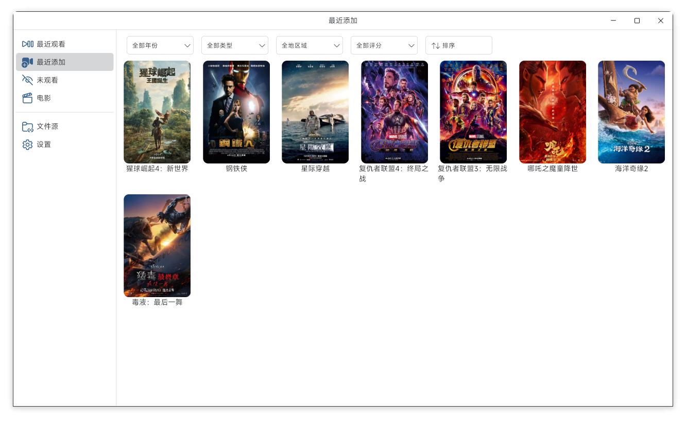
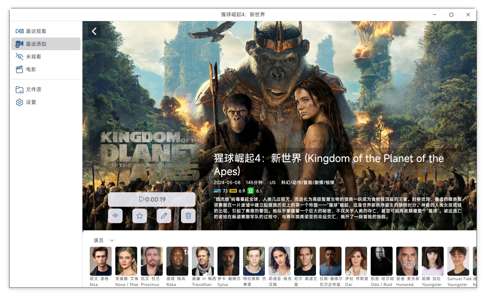
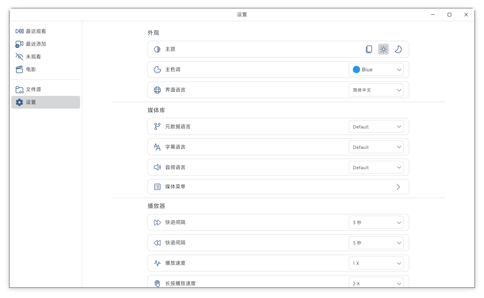
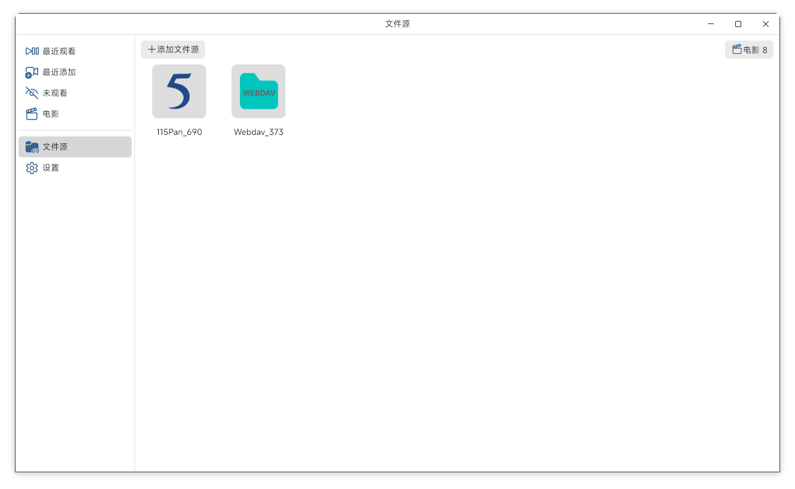
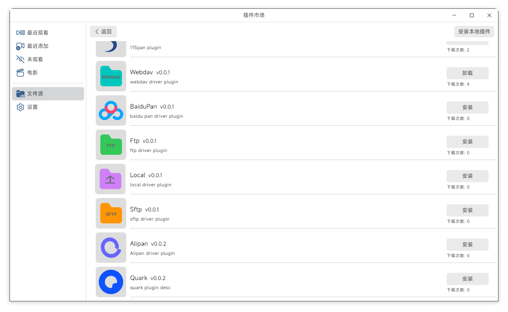

## Medianex

A powerful video player, supports various protocols and cloud disks, automatic generation of beautiful poster walls.

> Medianex is not open source,this orgs only store plugins and other depend repo

Screenshot

## Support Platform And Downloads

## Future Request OR Report Bug

[Future Request](https://github.com/orgs/medianexapp/discussions/new?category=future-request)

[Report Bug](https://github.com/orgs/medianexapp/discussions/new?category=bug-report)

## Support Plugins

Support various protocols and cloud disk access through plug-in design, plugins base on webassembly

[Plugins](https://github.com/medianexapp/plugins)

## How to devlop a plugin

> Need install [tinygo](https://github.com/tinygo-org/tinygo)  
> Note: tinygo's runtime file must replace this [PR](https://github.com/tinygo-org/tinygo/pull/4875/files)'s files src/runtime/\*.go, or wait next release

1. Install [plugin_api](https://github.com/medianexapp/plugin_api)  
   `go install github.com/medianexapp/plugin_api/cmd/plugin_api@main`
2. Init Plugin Project  
   `plugin_api init example`  
   `cd example`
3. Impl Plugin Method in file `plugin_impl.go`
4. Create your plugin's icon file and change plugin toml config file
5. Build Plugin  
   `make`
6. Install Plugin From Local

## Follow Author

  

